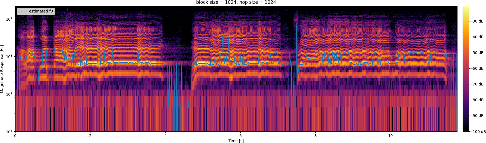
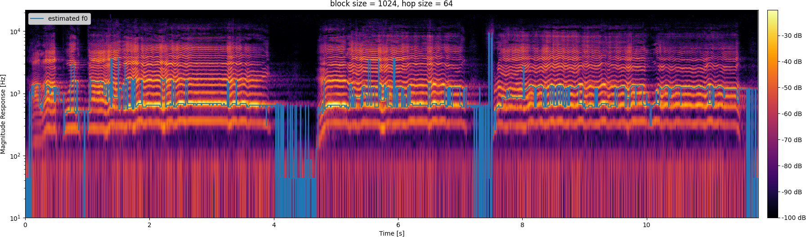

# FreqDomainPitchTracking

## To do

- [x] A. Maximum spectral peak based pitch tracker
  - [x] Implement a function `[X, fInHz] = compute_spectrogram(xb, fs)` that computes the magnitude spectrum for each block of audio in `xb` (calculated using the reference `block_audio()` from previous assignments) and returns the magnitude spectrogram `X` (dimensions blockSize/2+1 X numBlocks) and a frequency vector `fInHz` (dim blockSize/2+1,) containing the central frequency of each bin. Do not use any third party spectrogram function. Note: remove the redundant part of the spectrum. Also note that you will have to apply a von-Hann window of appropriate length to the blocks before computing the fft.
  - [x] Implement a function `[f0, timeInSec] = track_pitch_fftmax(x, blockSize, hopSize, fs)` that estimates the fundamental frequency $f_0$ of the audio signal based on a block-wise maximum spectral peak finding approach. Note: This function should use `compute_spectrogram()`.
  - [x] If the blockSize = 1024 for blocking, what is the exact time resolution of your pitch tracker? Can this be improved without changing the block-size? If yes, how? If no, why? (Use a sampling rate of 44100Hz for all calculations).
    - The time resolution is $\frac{f_s}{\mathrm{fft_block}} = \frac{44100}{1024} = 43.066\mathrm{Hz}$.
    - The resolution can be improved with smaller `hop_size`.
    - 
    - 

- [ ] B. HPS (Harmonic Product Spectrum) based pitch tracker
  - [ ] Implement a function `[f0] = get_f0_from_Hps(X, fs, order)` that computes the block-wise fundamental frequency $f_0$ given the magnitude spectrogram `X` and the samping rate based on a HPS approach of order order.
  - [ ] Implement a function `[f0, timeInSec] = track_pitch_hps(x, blockSize, hopSize, fs)` that estimates the fundamental frequency $f_0$ of the audio signal based on HPS based approach. Use `blockSize = 1024` in `compute_spectrogram()`. Use order = 4 for `get_f0_from_Hps()`
